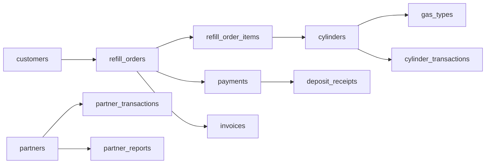

# Extended Documentation – Prem Gas Solution Admin System

---

## 1. High‑Level Business Context
Prem Gas Solution operates a **cylinder‑based gas distribution** model. Customers purchase gas refills for their own cylinders or rent cylinders on a per‑day basis. The business must track:
- **Customer accounts** (contact info, active cylinder count, security deposit balance).
- **Inventory** of cylinders, each uniquely identified by a serial number, gas type, and size.
- **Financials** including GST, discounts, rental fees, and deposits.
- **Partner relationships** for bulk supply and revenue sharing.
- **Cylinder exchange balances** — tracking which customer holds whose cylinders, with automatic settlement when ownership and possession match again.

The admin portal is the internal tool used by staff (super admins, billing clerks, warehouse supervisors) to manage all of the above.

---

## 2. Core User Roles & Permissions
| Role | Abilities |
|------|----------|
| **Super Admin** | Full access – manage users, partners, gas types, vendors, settings, exchange settlements, and all order functions. |
| **Billing Clerk** | Create and process refill orders, view customers, handle payments, generate invoices and deposit receipts, perform cylinder exchange settlements. |
| **Warehouse Supervisor** | Manage inventory (cylinders, stock counts), view inventory dashboards, update cylinder status, view cylinder audit logs, perform exchange settlements. |
| **Partner Manager** | View partner reports, manage partner transactions. |

Permission checks are performed via `has_role()` calls throughout the UI templates and API endpoints.

---

## 3. Data Model Overview (MySQL)

### Key Tables (selected columns)
- **customers**: `id`, `name`, `mobile`, `status`, `active_cylinders_count`, `deposit_balance`.
- **gas_types**: `id`, `name`, `default_price_per_kg`, `size_prices` (JSON mapping size → price), `sizes` (CSV list).
- **cylinders**: `id`, `serial_number`, `gas_type_id`, `size_capacity`, `status` (`filled`, `empty`, `with_customer`, `sent_to_vendor`, `returned_to_partner`, `returned_to_consumer`), `current_customer_id`, `ownership_type` (`owned`, `partner_owned`, `consumer_owned`), `original_owner_customer_id`, `daily_rent_rate`, `free_days`, `borrow_date`, `last_refill_date`.
- **refill_orders**: `id`, `customer_id`, `subtotal`, `tax_amount`, `discount`, `grand_total`, `payment_status`, `payment_method`, `notes`, `business_name`.
- **refill_order_items**: `refill_order_id`, `gas_type_id`, `cylinder_id`, `size_capacity`, `qty`, `price_per_unit`, `is_rental`, `rent_per_day`, `free_days`, `returned_cylinder_id`.
- **payments**: `id`, `customer_id`, `refill_order_id`, `amount`, `payment_method`, `payment_type` (`refill_payment`, `deposit_added`, `deposit_refunded`, `vendor_payment`, `rent_payment`), `notes`.
- **invoices**: `id`, `invoice_number`, `refill_order_id`, `invoice_date`.
- **deposit_receipts**: `id`, `receipt_number`, `payment_id`, `customer_id`, `receipt_date`.
- **cylinder_transactions**: `id`, `cylinder_id`, `customer_id`, `vendor_id`, `transaction_type` (`refill`, `issue_to_customer`, `return_from_customer`, `send_to_vendor`, `receive_from_vendor`, `maintenance`, `partner_borrow`, `partner_return`, `partner_lend`, `partner_receive_back`, `consumer_return`, `consumer_give_back`, `consumer_dispatch`), `transaction_date`, `notes`.
- **partners**, **partner_transactions**, **partner_transaction_items**: store partner meta‑data and transactional logs.

---

## 4. Order Creation – Detailed Flow
1. **UI Interaction** – Staff opens *Create Refill Order* page (`order-create.php`).
2. **Customer Selection** – Live‑search combo box queries the `customers` table (client‑side JS). Selecting a customer loads any *held cylinders* into the exchange panel (excluding settled cylinders).
3. **Item Row Construction** – Each row captures:
   - Gas type (populated from `gas_types`).
   - Size (dropdown, defaults to common sizes). If the gas type defines custom `size_prices`, the price is taken from that map.
   - Quantity.
   - Rental toggle – reveals *Rent per Day* and *Free Days* fields.
   - Optional **custom price** override.
4. **Cylinder Allocation Logic (PHP)** – For each unit:
   - If the user selected a specific serial, verify it exists, matches gas & size, and is `filled`.
   - Otherwise, query the next available `filled` cylinder excluding already allocated IDs for this order.
   - Record the allocated cylinder ID.
5. **Return (Exchange) Handling** – For each row, the UI can capture a *returned cylinder* serial. On submit:
   - **Customer returns own cylinder** → Settled: `status='empty'`, `current_customer_id=NULL`, log `consumer_give_back`.
   - **Customer returns different customer's cylinder** → Transferred: `status='with_customer'`, log `consumer_return`.
   - **Customer returns company/partner cylinder** → Standard: `status='empty'`, log `return_from_customer`.
   - **Unknown serial** → New `consumer_owned` cylinder created, log `consumer_return`.
   - Customer active count decremented if applicable.
6. **Financial Calculations** – Sub‑total, GST (18 % optional), discount, and grand total are computed server‑side.
7. **Database Transaction (PDO)** – All inserts/updates are wrapped in a `beginTransaction` → `commit` block. Any exception triggers `rollBack` and surfaces the error.
8. **Post‑Commit Steps**:
   - Insert a **payment** row for the refill charge and, if applicable, a separate deposit row.
   - Update the customer's `deposit_balance` (for rentals).
   - Create an **invoice** entry with a formatted number `INV-<year>-<padded_id>`.
   - Call `syncInventory($pdo)` to refresh aggregated stock counts.
   - Redirect to `invoice.php` for printable receipt.

---

## 5. Standalone Cylinder Exchange Settlement
1. **UI Interaction** – Staff opens *Cylinder Exchange* page (`cylinder-exchange.php`).
2. **Customer Selection** – Live‑search combo box.
3. **Exchange Balance Load** – AJAX call to `exchange-ajax.php` returns:
   - `our_with_them`: Company/partner cylinders with the selected customer.
   - `their_with_us`: Customer's consumer-owned cylinders in our inventory.
   - Counts and net balance.
4. **Left Panel (Returns)**: Enter serial numbers of cylinders the customer is returning. Quick-pick buttons auto-fill from held cylinders.
5. **Right Panel (Give-Backs)**: Checkboxes for customer-owned cylinders in our inventory to return.
6. **Submit Settlement**:
   - Each serial processed with ownership-aware logic (same rules as order-create.php).
   - Auto-settles when owner matches holder.
   - Full audit logging in `cylinder_transactions`.
   - Customer active count and inventory synced.

---

## 6. Inventory & Stock Management
- **Stock Counts** are pre‑computed on page load via queries that group by `gas_type_id` and `size_capacity` where `status='filled'`.
- The UI displays a **stock indicator** per item row. If the required quantity exceeds available stock, a warning banner appears and the submit button is disabled.
- `syncInventory()` (defined in `business_helper.php`) aggregates counts for all statuses (`filled`, `empty`, `with_customer`) and updates any cached values used by dashboards.
- **Settled cylinders** (consumer-owned where owner == holder) are excluded from active tracking views (`cylinders.php`, customer profile active list, exchange panels).

---

## 7. Rental Lifecycle
When `is_rental = 1`:
- The cylinder's `status` becomes `with_customer`.
- `daily_rent_rate`, `free_days`, and `borrow_date` are stored on the cylinder.
- Customer's `active_cylinders_count` increments.
- Security **deposit** is collected via an additional payment record and added to the customer's balance.
- The system does **not** automatically calculate rent accrual; this is expected to be handled by periodic billing or a separate script.

---

## 8. Cylinder Exchange & Settlement Rules

### Ownership Types
| Tag | Meaning |
|-----|---------|
| OWN | My company cylinder |
| BR | Borrowed/vendor cylinder |
| CON | Customer-owned cylinder |

### Active vs Settled
A cylinder appears in **active tracking** ONLY IF `owner != current_holder`.

| Scenario | Action | Log Type |
|----------|--------|----------|
| Customer returns our cylinder | `status='empty'`, `current_customer_id=NULL` | `return_from_customer` |
| Customer returns their OWN cylinder | `status='empty'`, `current_customer_id=NULL` | `consumer_give_back` (SETTLED) |
| Customer returns another customer's cylinder | `status='with_customer'`, `current_customer_id=selected` | `consumer_return` |
| Unknown serial from customer | Create new `consumer_owned` cylinder | `consumer_return` |
| We return customer's OWN cylinder | `status='empty'`, `current_customer_id=NULL` | `consumer_give_back` (SETTLED) |
| We give different customer's cylinder | `status='with_customer'`, `current_customer_id=selected` | `consumer_return` |
| We give company cylinder | `status='with_customer'`, `current_customer_id=selected` | `issue_to_customer` |
| Partner return | `status='returned_to_partner'`, clear partner fields | `partner_return` |

### Key Helper Functions
- **`settleCylinderExchange($pdo, $cylinder_id, $notes)`** — Settles a consumer-owned cylinder if held by its original owner.
- **`isCylinderInActiveExchange($cyl)`** — Returns true only if cylinder is in genuine mismatch state.
- **`logCylinderTransaction($pdo, $cylinder_id, $customer_id, $vendor_id, $type, $notes)`** — Central audit logging.

---

## 9. Security & Data Validation
- All inputs are **sanitized** and cast to appropriate types (`intval`, `floatval`).
- `try/catch` blocks guard against DB errors.
- Duplicate cylinder selection is prevented by checking `$already_allocated_ids`.
- Access control: `require_role(['super_admin', 'billing_clerk'])` at the top of `order-create.php` ensures only authorized staff can reach the page.
- CSRF protection is not shown in the excerpt but is assumed to be handled globally via a token in forms.

---

## 10. Extending the System
| Area | Suggested Extension |
|------|-------------------|
| **Reporting** | Build a reporting engine that aggregates rentals, deposits, and GST for quarterly financial statements. |
| **Background Jobs** | Move `syncInventory` to a nightly cron job to reduce per‑request load. |
| **API Layer** | Expose order creation and exchange settlement via a REST endpoint for integration with mobile POS devices. |
| **Audit Trail** | Expand `logCylinderTransaction` to capture user ID and IP address for compliance. |
| **Internationalization** | The UI already uses `__('key')` for language strings; add more translation files for additional locales. |

---

## 11. Deployment Notes
- **Web Server**: Runs on Apache with PHP 7.4+.
- **Database**: MySQL (or MariaDB) with the tables referenced above.
- **File Structure**: All admin pages reside under `e:\nutangasestsk.com\public_html\admin`. Shared helpers (`db.php`, `business_helper.php`, `auth.php`, `lang_init.php`) are required at the top of each script.
- **Configuration**: Database credentials are stored in `db.php`. Session handling and role definitions are in `auth.php`.
- **Styling**: Admin CSS (`admin-style.css`) provides a modern dark‑mode capable UI; icons are inline SVGs.

---

## 12. Quick Glossary
- **Refill Order** – Sale of gas to a customer, may include cylinder rental.
- **Cylinder** – Physical gas container tracked by serial number.
- **GST** – Goods and Services Tax, 18 % applied to subtotal when enabled.
- **Deposit** – Security amount for rented cylinders, stored on the customer record.
- **Partner** – External entity (supplier) linked to the business for reporting purposes.
- **Exchange Settlement** – Process of returning cylinders between parties to close pending exchange mismatches. Can occur during a refill order or as a standalone operation.
- **Active Exchange** – A cylinder where the owner and current holder are different (pending exchange).
- **Settled Exchange** – A cylinder where the owner and current holder are the same (exchange closed, removed from active tracking).

---

**End of extended documentation**. This file gives an AI a complete conceptual model of the software, its business purpose, data structures, operational flow, and cylinder exchange settlement logic without needing to parse every line of code.
